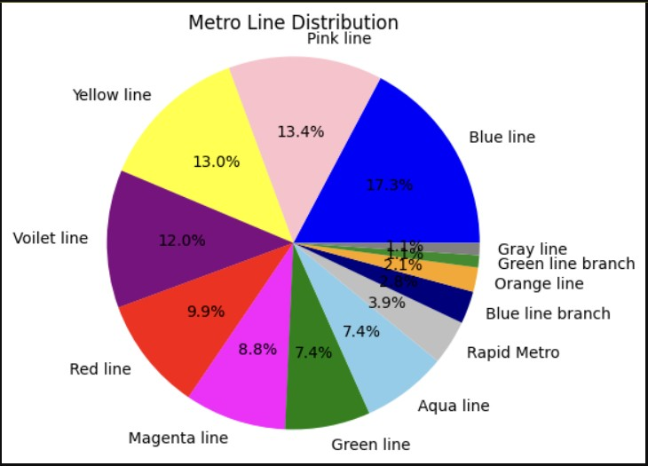
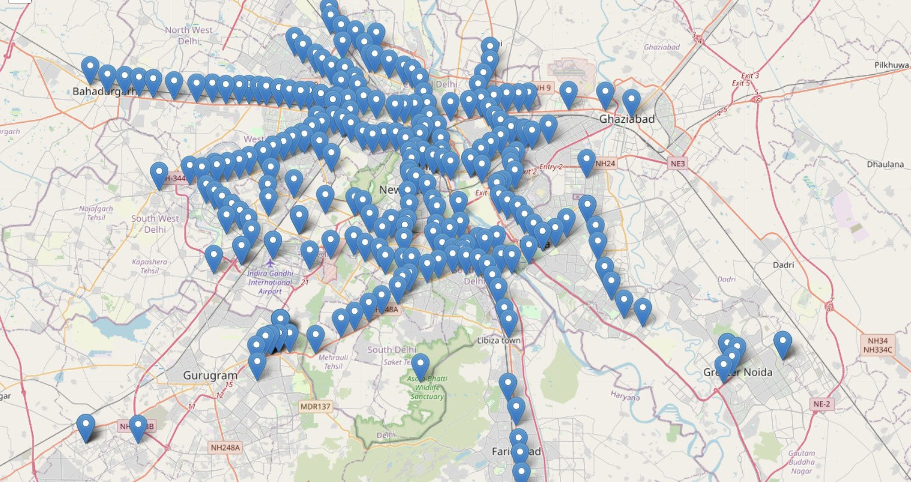
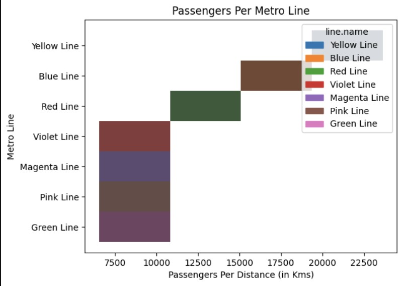
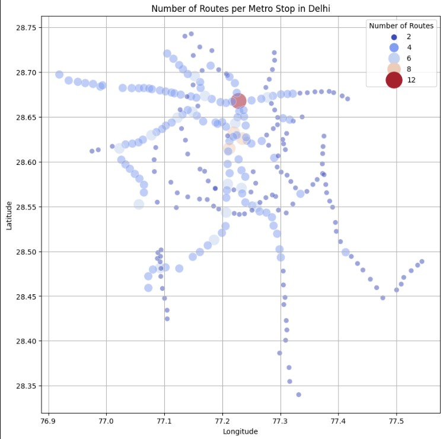
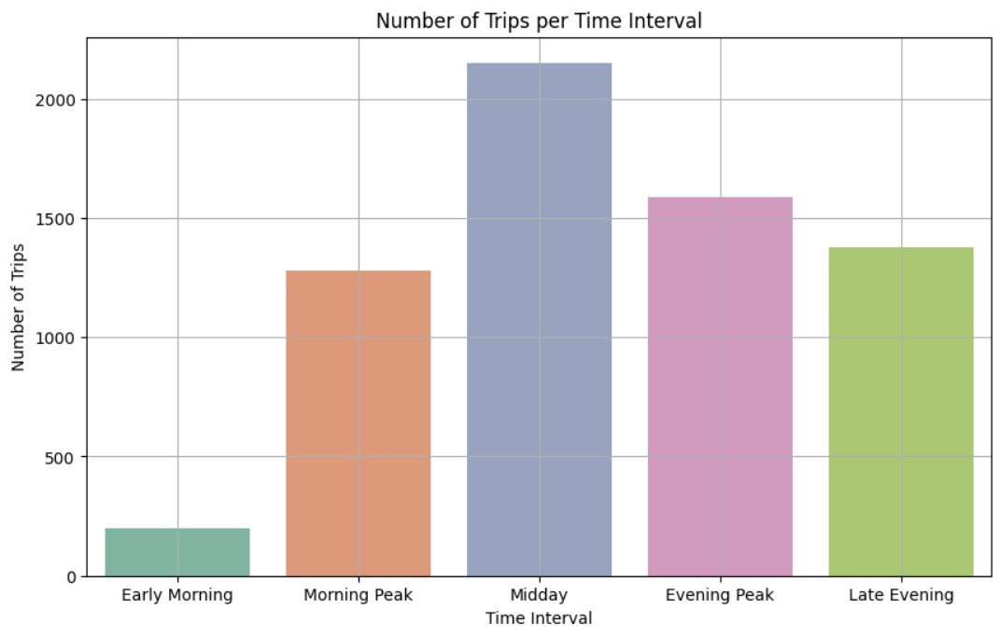
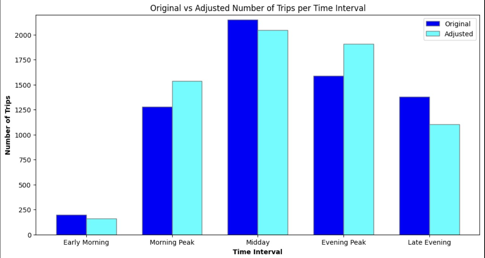

# 🚇 Delhi Metro Network Optimization & Passenger Load Analysis

## 📌 Overview
This project analyzes the **Delhi Metro network** using **DMRC GTFS datasets** and passenger load data to:
- Understand the **distribution of metro lines**
- Map **station locations & routes**
- Analyze **passenger load patterns**
- Simulate **schedule optimizations** to improve service during peak hours

It combines **data visualization**, **geospatial mapping**, and **statistical analysis** to explore operational improvements for the Delhi Metro.

---

## 📂 Dataset Sources

1. **Delhi Metro GTFS Data (DMRC)**

- [agency.txt](datasets/agency.txt) → Metro agency details  
- [calendar.txt](datasets/calendar.txt) → Service schedule  
- [routes.txt](datasets/routes.txt) → Metro line details  
- [shapes.txt](datasets/shapes.txt) → GPS coordinates of route paths  
- [stop_times.txt](datasets/stop_times.txt) → Timings of trains at stations  
- [stops.txt](datasets/stops.txt) → Station names & coordinates  
- [trips.txt](datasets/trips.txt) → Individual scheduled train journeys  
 

2. **Delhi Metro Station Data**  
   🔗 [stations.csv](datasets/Delhi Metro.csv) 

3. **Passenger Load Data (2022)**  
   *Provided as an Excel file in `/data/`* — contains passengers per km for each metro line.

---

## ✨ Features
- **Metro Line Distribution Analysis** – Pie chart showing station distribution per line.
- **Interactive Metro Map** – Folium map of all stations with GPS coordinates.
- **Distance Analysis** – Histogram of distances from first station.
- **Passenger Load Analysis** – Histograms & trends of passengers per km per line.
- **Route Frequency Mapping** – Scatter plot showing how many routes serve each stop.
- **Train Interval Analysis** – Average time gap between trains by part of day.
- **Demand-Based Trip Adjustments** – Simulation of increased/decreased trips during peak/off-peak hours.

---

## 📊 Visualizations

### 1️⃣ Metro Line Distribution

### 2️⃣ Interactive Station Map

### 3️⃣ Passenger Load Trends

### 4️⃣ Routes Per Stop

### 5️⃣ Average Train Intervals

### 6️⃣ Trip Adjustment Simulation

*(All images are generated from the Jupyter Notebook and saved in `/images/`.)*
